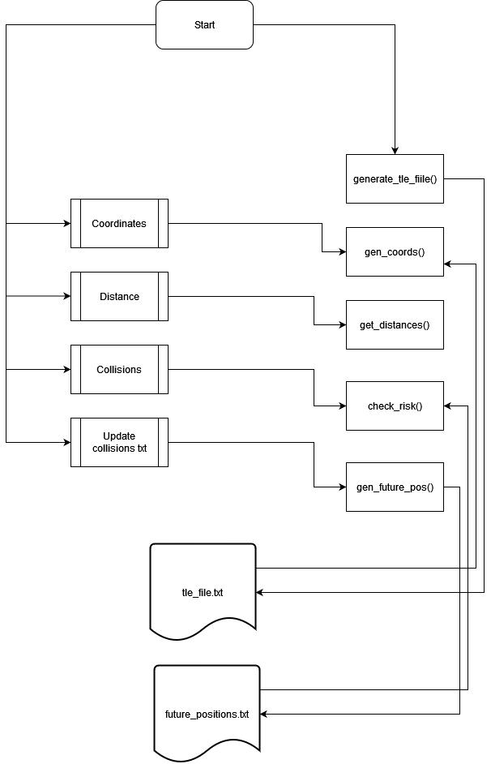

# SpacesApps 2021 - Mapping Space Trash in Real Time

This git repository corresponds to the code written for the *Mapping Space Trash in Real Time* challenge during the *SpaceApps 2021* competition by team ***JAIA***.

The programming language used for this project was **Python**, in which **Flask** was utilized as a framework for the web application where all the information and data is visualized. 

The objects tracked by this application correspond to the debris left by the collision and destruction of the russian satellite ***Cosmos 2251***.

In order to obtain the data corresponding to debris currently orbiting around Earth, **CelesTrak** was used to obtain the TLE prameters, which are then passed as arguments to the **Skyfield API**, which obtains the coordinates and elevation corresponding to the satellite at a given time. This information is displayed on the web application and is refreshed when said web application is manually refereshed by the user.

The program also allows the user to check for pair of debris which are at least 200km near each other. Due to processing issues, only 200 pairs of debris are analyzed.

The user is also given the possibility of checking for future possible collisions between two debris. This is done by tracking the position of all debris a given time interval into the future (60 minutes by default) and then cheking if their coordinates and elevations are too close to each other. Though the generation of future positions take some time, they are stored inside a *.txt* file so that the positions musn't be generated every time the program is launched.

## User Manual

In order to run the program, the user must first install all *dependencies* required to run the application. To do this, access the project's directory through the command line (WindowsPower Shell for Windows) and type in the following command.

```bash
pip install -r requirements.txt

```

To run the program, the user must access the proyect's ***src/*** directory and execute the following command from the command line.

```bash
flask run
```

This will then proceed to execute the web application where the data is found.

The user is also given the option to generate the .txt file where all the future positions are stored, though users must be cautious since this process takes some time. Nonetheless, the functionality of the "collision predictor" can be tested using the [.txt file generated at 10/03/2021, 23:42:01 UTC-6](./txt/cosmos-2251-debris-future-pos.txt).

## Issues

Though *none of the issues* listed in this section affect the functionality of the program, they take a toll on the app's *processing speed*.

It might be possible to achieve a better *performance* by using *multiple threads* to execute the heavy processes like the generation of future positions or the analysis of the distances between pairs of debris.

## Design



## Credits

### Authors

- Ana Isabella Aguilar Pineda
- Jessica Lan Huang
- Israel López Vallecillo

### Third parties

- [CelesTrak](https://celestrak.com/)
- [Flask](https://flask.palletsprojects.com/en/2.0.x/)
- [Python](https://www.python.org/)
- [Skyfield](https://rhodesmill.org/skyfield/)
